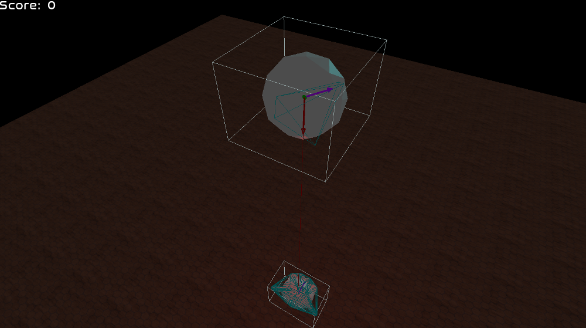
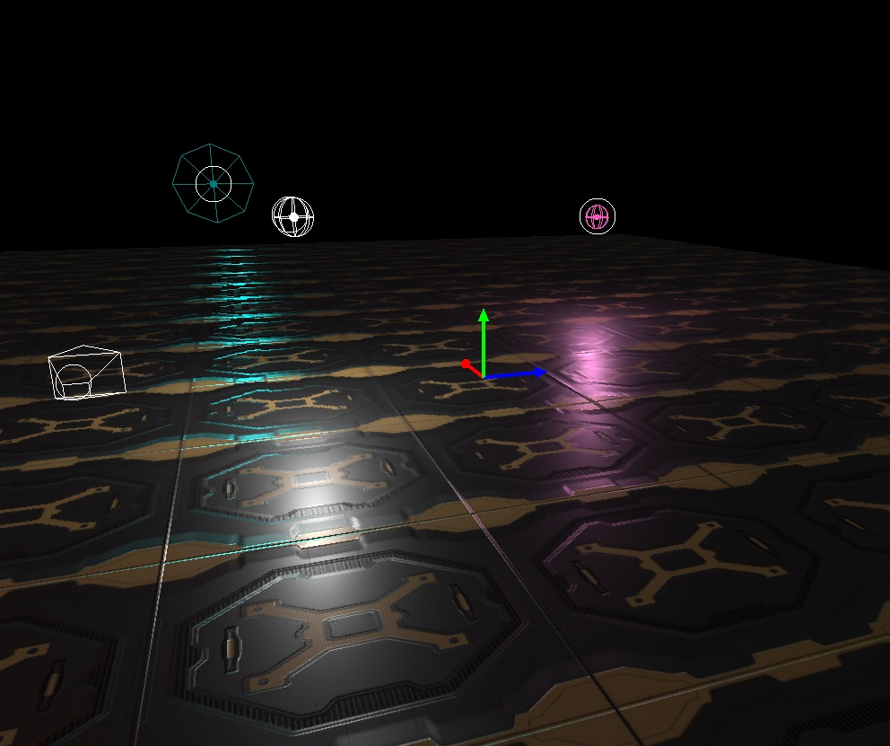

Following is a (probably incomplete) list of software that I've written.
You'll probably notice that Java is the language I'm most comfortable with,
but code-switch (pun intended) to C/C++/Python/JavaScript/whatever when
convenient.

####  Minecraft Mods
I'm into Minecraft, I'm into coding, so guess what?

##### clientcommands
clientcommands is a mod which adds many useful (and some downright cheaty)
client-side commands. Features include an in-game calculator, a chest-searching
command, RNG manipulation exploits such as an enchantment table cracker
and infinite tools, and a book filler command.

[Project on GitHub](https://github.com/Earthcomputer/clientcommands)

##### Enchantment Cracker
Not strictly a mod, but an external "calculator" tool for those who are in
a situation where they can't (or don't want to) use the mod. The GUI is
looking nice now thanks to Hexicube!

[Project on GitHub](https://github.com/Earthcomputer/EnchantmentCracker)

##### multiconnect
This mod can be installed by users on the latest release version of Minecraft,
allowing them to connect to servers on older versions without having to
switch to a compatible client version.

Still a WIP, in the mean time, players can also install
[Connect to 1.12.x](https://github.com/Earthcomputer/Connect-to-1-12-x) to
connect from a 1.12.2 client across the 1.12.x minor releases.

[Project on GitHub](https://github.com/Earthcomputer/multiconnect)

##### EasyEditors
This 1.11 mod aims to make certain annoying GUIs in Minecraft easier to use.
By far its biggest feature is the command editor, which can generate commands
in a command block, without you having to remember what's what.

[Project on GitHub](https://github.com/Earthcomputer/Easy-Editors)

#### Games
Making games is one of the most satisfying things you can do with coding.
Here are some of the games I've made.

##### Stepfish
Stepfish is an arcade-style platformer I made for fun. The idea
is, you can only stand on platforms of your own colour. My brother made
the artwork.

[Project on GitHub](https://github.com/Earthcomputer/Stepfish)

##### Clockback
Clockback is a 3D game engine I wrote with a friend. It includes a rendering engine,
a physics engine, an ECS (Entity Component System) framework, a GUI toolkit, a
serialization framework, and probably some other smaller things I've forgotten about.
We intend to make it into a game in its own right in the future.

This project is closed-source.

#### Tools
Often if you need a program to do something, there will be some which do
just what you're looking for that you can just download. However, I sometimes
find myself in a situation where nothing exists which does quite what I want,
so I make my own tool. In case others happen to have the same niche usecases
as me, here are some tools that I've written.

##### DiffSorter
This tool is for when you have a large diff between two versions of, say,
a piece of software, with many unrelated changes in it, which could be
split into multiple smaller diffs containing related changes. My usecase
is diffing two decompiled release versions of closed-source software, where
you don't have access to the individual commits.

[Project on GitHub](https://github.com/Earthcomputer/DiffSorter)

##### CollectionVisualizer
A library to visualize the internal structure of Java collections in real
Java programs. Not only is it useful educationally, but it also helped me
wrap my head around a couple of bugs I found in Java's HashMap.

[Project on GitHub](https://github.com/Earthcomputer/CollectionVisualizer)

